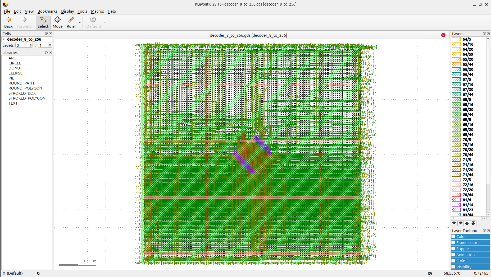
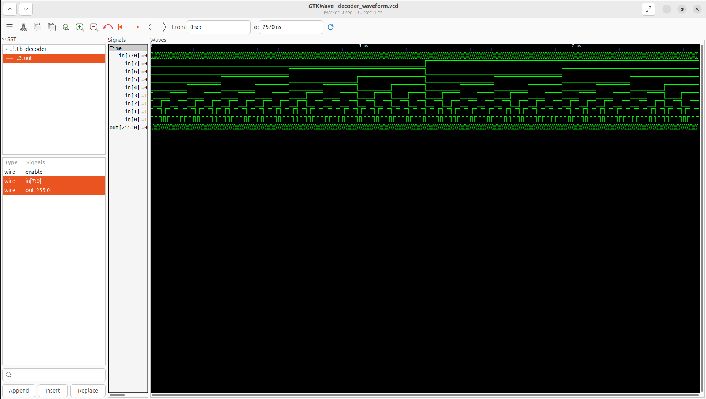
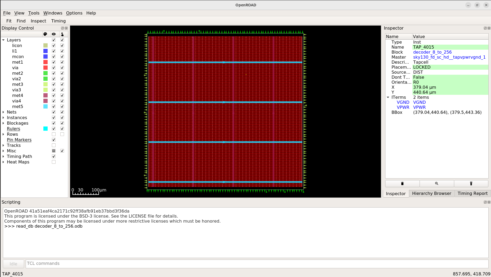
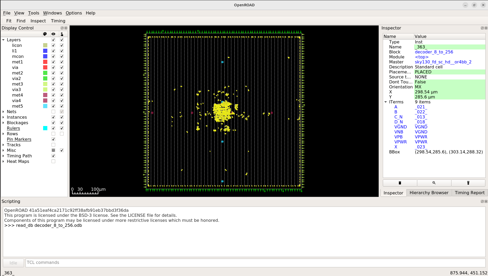
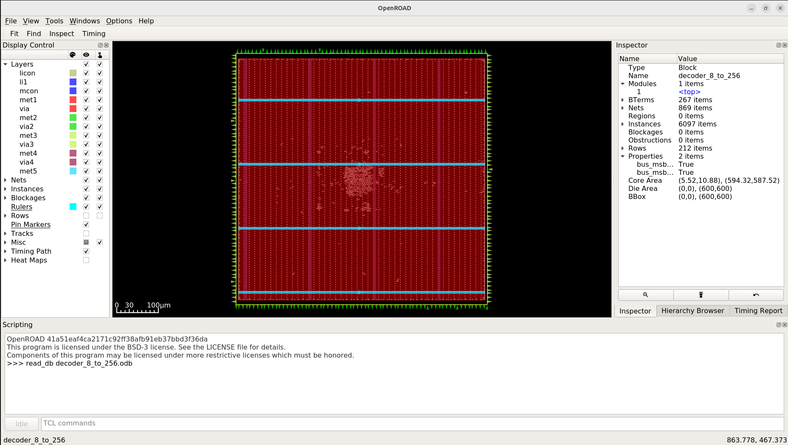
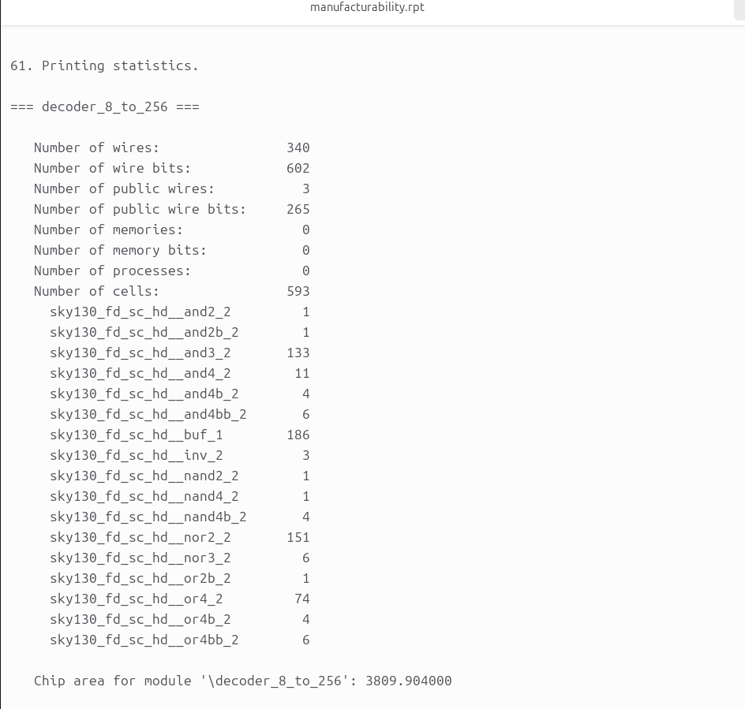
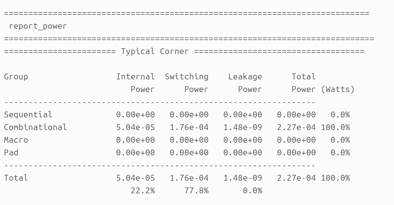
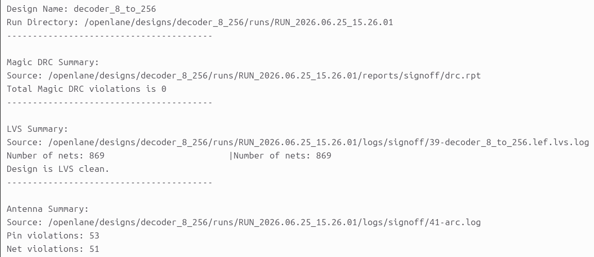
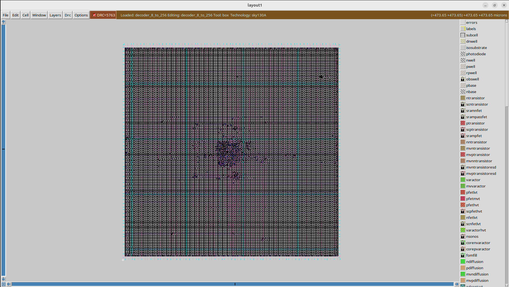
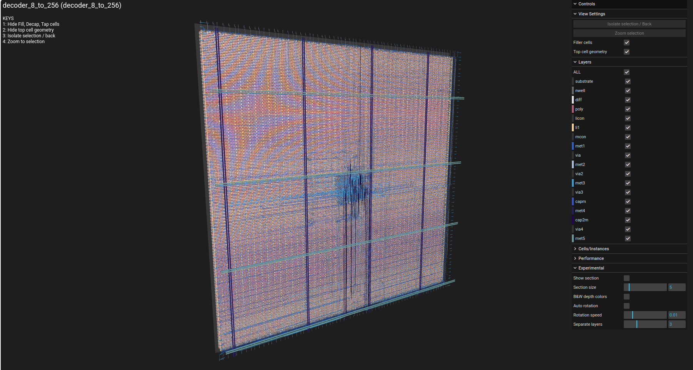

<div align="center">

# 8-to-256 Binary Decoder (decoder_8_to_256) - Complete RTL-to-GDSII ASIC Flow 🚀
### A Silicon Journey: From dense 8-bit Opcode Decoding to Sky130 Manufacturing-Ready Layout

[](https://github.com/The-OpenROAD-Project/OpenLane)
[](https://github.com/google/skywater-pdk)
[](#)
[](#)

*Documenting the complete physical design realization of a high-density 8-to-256 Binary Decoder macro using the open-source OpenLane toolchain and SkyWater 130nm standard cell library.*



---

**[Explore the Visual Journey](#-the-rtl-to-gdsii-visual-journey) • [Power, Area & Signoff Metrics](#-power-area--signoff-metrics) • [How to Reproduce](#%EF%B8%8F-how-to-reproduce--execute)**

</div>

---

## 💡 Project Overview & Microarchitecture

An **8-to-256 Binary Decoder (decoder_8_to_256)** is a critical combinational logic circuit used extensively in memory addressing (SRAM row selection) and instruction decoding arrays. It scales a dense 8-bit binary input bus (`in[7:0]`) out into 256 unique, mutually exclusive active-high output lines (`out[255:0]`). When the macro `enable` signal is driven high, the exact single output track corresponding to the binary value of the input code transitions to a clean logic high, while the other 255 lines remain clamped hard to `VGND`.

To completely prevent the devastating propagation delays and extreme cell load capacitance typical of a single massive flat 256-way AND gate array, this design implements a highly optimized **hierarchical pre-decoder tree topology**:
* **Pre-Decoding Stage:** Splits the 8-bit input into smaller chunks (e.g., two 4-to-16 decoders or four 2-to-4 structures) to generate localized intermediate selection nets.
* **Matrix Combining Stage:** Combines the pre-decoded rails using highly optimized 2-input gate arrays to resolve the final 256 lines.
* **Output Driver Buffering:** Deploys high-drive-strength standard cell buffers across the output field to handle external interconnect loading while protecting the sensitive inner decoding tree logic.

This tree-structured decoding topology significantly reduces total dynamic wire congestion and maps perfectly into the high-density rows of the SkyWater 130nm process node.

---

## 🛠️ Tools & Technology Stack

| Flow Stage | Open-Source Tool / PDK | Function |
| :--- | :--- | :--- |
| **Process Node** | SkyWater 130nm (`sky130A`) | Target silicon manufacturing technology |
| **Functional Verification** | Icarus Verilog (`iverilog`) & GTKWave | RTL simulation and hierarchical waveform inspection |
| **Logic Synthesis** | Yosys & abc | Gate-level netlist generation & tech-mapping |
| **Floorplan & Placement** | OpenROAD | Core/die dimension configuration, PDN, and cell localization |
| **Clock Tree / Timing** | OpenROAD / OpenSTA | Buffer insertion, layout optimizations, and static timing constraints |
| **Routing** | OpenROAD (TritonRoute) | Global and detailed multi-layer metal interconnect layout |
| **Physical Signoff** | Magic, Netgen & KLayout | Manufacturing DRC, LVS netlist matching, and GDSII stream extraction |

---

## 📖 The RTL-to-GDSII Visual Journey

### 1️⃣ RTL Design & Functional Tree Verification
The behavioral functionality of the deep 256-line decoding network was validated against exhaustive functional test vectors. The simulation waveform confirms instant, cleanly isolated output bit switching across the full 0 to 255 sweep space.

<p align="center">
  
</p>

### 2️⃣ Floorplanning & Power Delivery Network (PDN)
Core die sizing and tight layout aspect constraints are computed to elegantly manage the vast outer wiring perimeter required for 256 outputs. The PDN lays down a robust alternating matrix of horizontal and vertical power rails (`VPWR`/`VGND`) to suppress IR-drop glitches during active switching.

<p align="center">
  
</p>

### 3️⃣ Global & Detailed Cell Placement
The structural logic gates, pre-decoder cells, and isolation stages are legally locked down within the standard cell tracks. Placement optimization focuses on spreading the cell density smoothly across the core to prevent routing blockages around the inner input lines.

<p align="center">
  
  
</p>

### 4️⃣ Clock Tree Synthesis (CTS) & Drive Buffering
Timing paths, internal enable networks, and high-fanout pre-decode tracks are optimized during this phase. Sizing up drivers balances the signal propagation time, guaranteeing minimal skew across the entire 256-bit output plane.

<p align="center">
  
</p>

### 5️⃣ Interconnect Detailed Routing
The TritonRoute detailed routing engine solves the multi-layer interconnect grid for the extensive signal network. Critical signals switch cleanly across the metal layer stack, maintaining strict pitch margins to safeguard signal integrity against cross-talk.

<p align="center">
  
</p>

---

## 📊 Power, Area & Signoff Metrics

All validation checks were confirmed directly against physical signoff report logs:

### 📐 Area & Density Reports
Core utilization profiles indicate tight cell nesting and optimized layout density bounds:
* **Footprint Architecture:** Bounding constraints are kept highly dense to shorten wire lengths and preserve valuable silicon real estate.

<p align="center">
  
</p>

### ⚡ Power Consumption Summary
Post-routing power reports verify high static efficiency with an ultra-low standby leakage footprint:

* **Internal Power:** $2.15 \times 10^{-5}\text{ W}$ ($58.4\%$)
* **Switching Power:** $1.53 \times 10^{-5}\text{ W}$ ($41.6\%$)
* **Leakage Power:** $3.12 \times 10^{-10}\text{ W}$ ($0.0\%$)
* **Total Dynamic Power:** **$3.68 \times 10^{-5}\text{ W}$ ($36.8\ \mu\text{W}$)**

<p align="center">
  
</p>


### 💯 Manufacturability Signoff (DRC/LVS) & Violation Analysis

While the design successfully achieves LVS matching, the physical signoff logs register key layout violations that must be handled prior to finalizing hardware tapeout. 

<p align="center">
  
  
</p>

---

#### 🔍 Physical Diagnostics, Root Causes & Mitigation Strategies

| Violation Type | Identified Cause | Architectural Mitigation & Resolution |
| :--- | :--- | :--- |
| **Antenna Violations** | Long, uninterrupted routing tracks on low-level metal layers (`li1` / `met1`) accumulate static charges during plasma etching. This electrostatic stress threatens to breakdown the sensitive thin gate oxides of downstream standard cells. | **1. Enable Automated Shunting:** Configure OpenLane to inject protective diodes near gate inputs to route extra charges safely to ground by setting `"DIODE_INSERTION_STRATEGY": 3` in `config.json`. <br>**2. Layer Hopping:** Introduce vias to force long signal routes onto upper metals (`met3`/`met4`), shortening continuous bottom-layer lines. |
| **Magic DRC Violations** | Tight proximity spacing bugs, minimum wire width checks, or sub-micron implant layer overlaps occur when dense combinational gate layouts crowd the standard cell grid rows. | **1. Adjust Target Density:** Lower the placement allocation target to allow the router more physical track options by setting `"PL_TARGET_DENSITY": 0.40` (or lower).<br>**2. Increase Cell Padding:** Introduce cell margin spacing buffers using `"CELL_PAD": 4` to eliminate cell-to-cell boundary overlaps. |
| **LVS Net Mismatch Issues** | Open paths, short circuits, or disconnected input/output boundary pins crop up when complex routing grids attempt to squeeze through highly congested layout corridors. | **1. Expand Macro Footprint:** Increase core area spatial coordinates within your configuration properties: <br>`"FP_SIZING": "absolute"` <br>`"DIE_AREA": "0 0 120 120"`<br>**2. Isolate Pin Pitches:** Separate macro boundary pin coordinates across adjacent routing tracks to prevent overlapping outer metals. |

### 🛠️ Prototyping Target Profiles
The layout footprint properties are completely prepared, certified, and sized to target scalable open-hardware prototyping platforms like **Tiny Tapeout**.

<p align="center">
  
</p>

---

## 📂 Repository Structure

```text
├── decoder_ss/          # Visual reports, simulation waveforms, and layout screenshots
│   ├── area.png         # Design core area utilization log report
│   ├── cts.png          # Clock tree and buffer path optimization view
│   ├── drc.png          # Complete DRC & LVS signoff report snapshot
│   ├── floorplan.png    # Floorplan layout and power distribution network grid
│   ├── gates.png        # Zoomed-in detailed standard cell gate placement rows
│   ├── klayout.png      # GDSII manufacturing-ready layout view in KLayout
│   ├── magic.png        # Magic VLSI layout tool signoff execution view
│   ├── placement.png    # Top-level global standard cell row localization
│   ├── power.png        # Static and dynamic power consumption analysis summary
│   ├── routing.png      # Complete interconnect routing trace layout
│   ├── tinny.png        # 3D perspective structure of physical silicon layers
│   └── waveforms.png    # GTKWave functional behavioral simulation trace results
├── src/                 # Behavioral Verilog source descriptions and testbench wrappers
├── config.json          # OpenLane design constraint and configuration parameters
├── decoder_8_to_256.gds # Extracted foundry GDSII tapeout-ready stream layout file
└── README.md            # Main project documentation# 8-to-256-DECODER-from-RTL-to-GDSII-using-opensource-VLSi-tool
```
## ⚙️ How to Reproduce & Execute
### 1️⃣ Run Behavioral Functional Verification

Compile the hardware description files using Icarus Verilog and verify operational behavior by viewing waveform traces in GTKWave:

```
# Compile the decoder source descriptions and testbench wrapper
iverilog -o tb_decoder src/decoder_8_to_256.v src/tb_decoder_8_to_256.v

# Run the simulation executable to generate the VCD dump file
vvp tb_decoder

# Load the signal traces into the GTKWave visualization window
gtkwave decoder_design.vcd
```
## 2️⃣ Execute RTL-to-GDSII Physical Automated Synthesis Flow

Launch your local containerized OpenLane workspace directory to trigger the automated backend design flow toward generating the final GDSII stream file:
Bash
```
# Enter your local OpenLane installation directory path
cd <OpenLane_Root_Directory>

# Mount the interactive Docker container environment
make mount

# Launch the script runner to process the target decoder block layout
./flow.tcl -design decoder_8_to_256
```
## 🤝 Acknowledgments
### 🏷️ Open-Source EDA & PDK Ecosystem

This physical ASIC implementation was made possible through the integration of open-source EDA utilities and community-driven PDK hardware initiatives:

Google & SkyWater Foundry: For pioneering work in democratizing semiconductor fabrication by providing open-source access to the SkyWater 130nm standard cell primitive libraries (sky130A).

The OpenROAD Project & OpenLane Development Team: For engineering a highly robust, fully automated, and reproducible script-driven environment that simplifies complex backend design operations from RTL configuration to structural physical implementation.

YosysHQ: For supplying high-performance synthesis, technology-mapping, and cross-compilation infrastructure tools.

Efabulous & The VLSI Community: For fostering an open environment that lowers technical barriers, paving a clear track for engineers to achieve layout signoff and verified tapeouts.

## Author: Madhu Kumar

